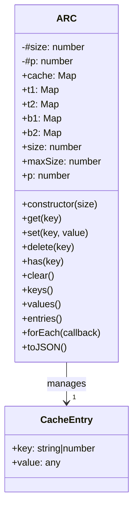
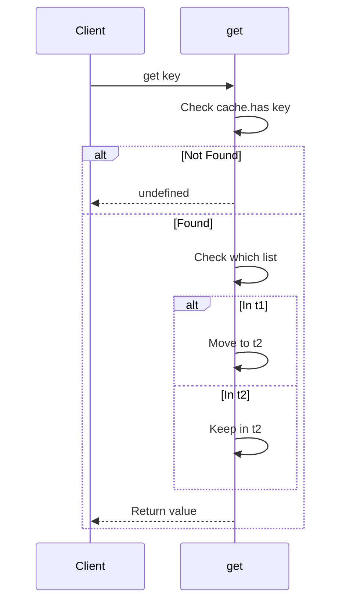
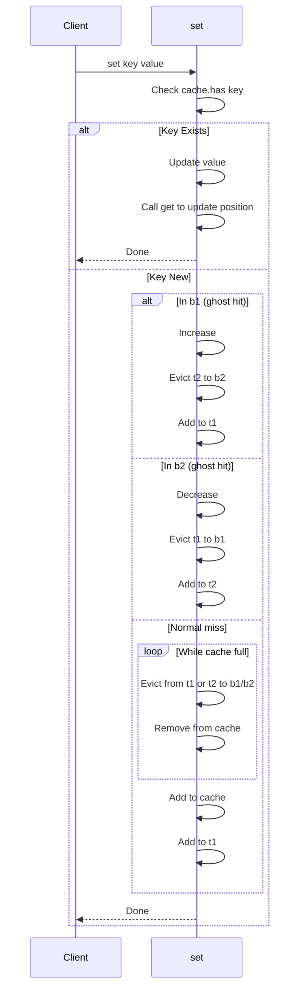
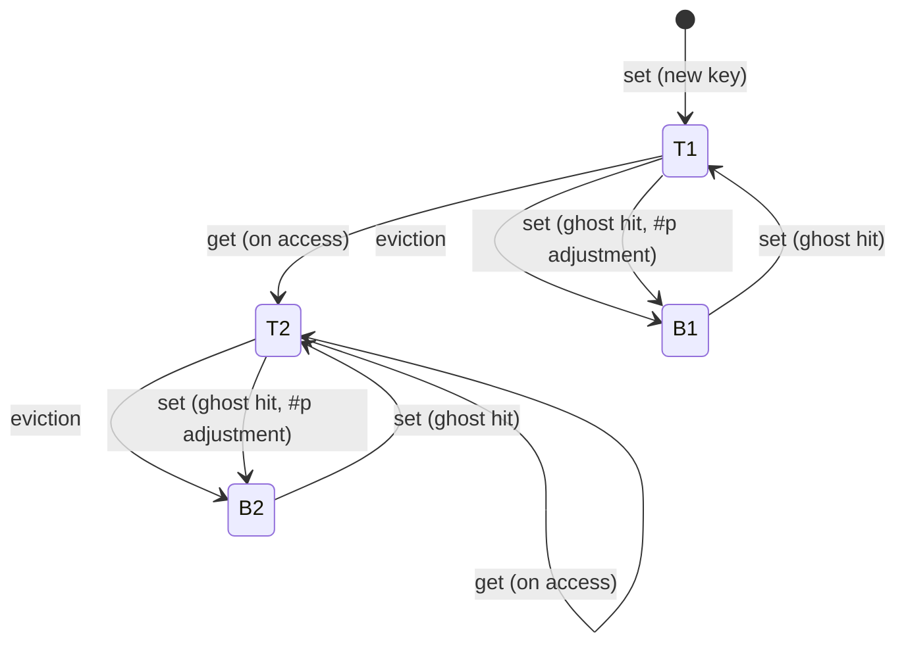

# ARC Architecture and Data Flow

<!-- toc -->

- [Overview](#overview)
- [Architecture](#architecture)
  - [Core Components](#core-components)
  - [Internal Data Structures](#internal-data-structures)
- [Mathematical Foundation](#mathematical-foundation)
  - [Notation](#notation)
  - [Ghost Hit Adjustments](#ghost-hit-adjustments)
  - [Eviction Logic](#eviction-logic)
  - [Size Constraints](#size-constraints)
  - [Visual Representation](#visual-representation)
  - [Proof of Adaptive Behavior](#proof-of-adaptive-behavior)
- [The p Boundary](#the-p-boundary)
  - [Ghost Hit Behavior](#ghost-hit-behavior)
  - [Example](#example)
- [Eviction Strategy](#eviction-strategy)
- [Data Flow](#data-flow)
  - [Retrieval Flow get](#retrieval-flow-get)
  - [Insertion Flow set](#insertion-flow-set)
- [State Transitions](#state-transitions)
  - [State Transition Table](#state-transition-table)
- [Memory Management](#memory-management)
  - [Cleanup on Delete](#cleanup-on-delete)
  - [Clear Operation](#clear-operation)
- [Performance Characteristics](#performance-characteristics)
- [Factory Function](#factory-function)
- [Design Decisions](#design-decisions)
  - [Why 5 Maps?](#why-5-maps)
  - [Why Ghost Lists?](#why-ghost-lists)
  - [Why Evict All Lists?](#why-evict-all-lists)
  - [Why Use Transient and Stable Lists?](#why-use-transient-and-stable-lists)

<!-- tocstop -->

## Overview

The `adaptive-replacement-cache` library implements the Adaptive Replacement Cache (ARC) algorithm, which adaptively balances between recently accessed and frequently accessed items to maximize cache hit rates.

## Architecture

### Core Components



### Internal Data Structures

The ARC implementation maintains 5 data structures:

| Map | Purpose | Contents |
|-----|---------|----------|
| `cache` | Main storage | All cached key-value pairs |
| `t1` | Recently accessed (L1) | Keys accessed once, recently (transient) |
| `t2` | Frequently accessed (L2) | Keys accessed multiple times (stable) |
| `b1` | Ghost list for T1 | Keys evicted from T1 (metadata only) |
| `b2` | Ghost list for T2 | Keys evicted from T2 (metadata only) |

**Notation:**
- **T1/B1** (L1): Track recently accessed entries
- **T2/B2** (L2): Track frequently accessed entries
- **p**: Boundary parameter controlling the target size of T1 (with T2 size = maxSize - p)

**Combined directory visualization:**
```
... [   B1  <-[     T1    <->      T2   ]->  B2   ] ...
      [ . . . . [ . . . . . . ! . .^. . . . ] . . . . ]
                [   fixed cache size (c)    ]
```

Where:
- `!` = actual cache boundary
- `^` = target size for T1 (controlled by `#p`)

## Mathematical Foundation

The ARC algorithm uses mathematical formulas to adaptively balance between recency and frequency based on observed access patterns.

### Notation

Let:
- $C$ = cache capacity (maxSize)
- $p$ = target size for T1 boundary parameter
- $|T1|$ = current size of T1 list
- $|T2|$ = current size of T2 list  
- $|B1|$ = current size of B1 ghost list
- $|B2|$ = current size of B2 ghost list
- $L1 = T1 \cup B1$ = combined L1 (recent) list
- $L2 = T2 \cup B2$ = combined L2 (frequent) list

### Ghost Hit Adjustments

When a ghost hit occurs, $p$ is adjusted using these formulas:

**B1 Ghost Hit** (entry re-entered that was evicted from T1):
$$p = \min\left(C, p + \left\lfloor \frac{|B2|}{|B1|} \right\rfloor \right)$$

This increases T1 size because the re-accessed entry was recently evicted, suggesting we should favor recency.

**B2 Ghost Hit** (entry re-entered that was evicted from T2):
$$p = \max\left(0, p - \left\lfloor \frac{|B1|}{|B2|} \right\rfloor \right)$$

This decreases T1 size because the re-accessed entry was from the frequent list, suggesting we should favor frequency.

### Eviction Logic

When evicting from T1 or T2, the algorithm uses this comparison:

$$\text{evict from T2 if: } |T1| > 0 \land (p \ge C \lor (p < C \land |B1| < |B2|))$$

Otherwise evict from T1.

### Size Constraints

The algorithm maintains these invariants:
- $|T1| + |T2| + |B1| + |B2| \le C$
- $0 \le p \le C$
- $|T1| \le p$
- $|T2| \le C - p$

### Visual Representation

The combined directory can be visualized as:

$$\ldots [\ \ \ [B1] \leftarrow [T1] \leftrightarrow [T2] \rightarrow [B2]\ \ ] \ldots$$

Where:
- $!$ represents the actual cache boundary ($|T1| + |T2|$)
- $\wedge$ represents the target boundary ($p$)
- $C$ is the fixed cache size

### Proof of Adaptive Behavior

The ghost hit formulas ensure $p$ converges to the optimal balance:

1. When B1 gets more hits, $|B1|$ grows relative to $|B2|$
2. This causes $p$ to increase (favoring T1/recency)
3. When B2 gets more hits, $|B2|$ grows relative to $|B1|$
4. This causes $p$ to decrease (favoring T2/frequency)

The $\lfloor \frac{|B2|}{|B1|} \rfloor$ and $\lfloor \frac{|B1|}{|B2|} \rfloor$ terms provide proportional adjustment based on the relative sizes of the ghost lists, ensuring smooth adaptation without oscillation.

## Data Flow

### Retrieval Flow get

When a key is retrieved:

1. If not in cache → return `undefined`
2. If in `t1` → move to `t2`
3. If in `t2` → keep in `t2` (refreshed at end)



### Insertion Flow set

When a new key is inserted:

1. If key exists → update value and call `get`
2. If key in `b1` (ghost hit) → increase `#p`, evict from `t2` to `b2`, add to `t1`
3. If key in `b2` (ghost hit) → decrease `#p`, evict from `t1` to `b1`, add to `t2`
4. If cache full → evict until space available:
   - If `t1.size > 0` and condition met → evict `t2` to `b2`
   - Otherwise → evict `t1` to `b1`
5. Add key to `cache` and `t1`



## The p Boundary

The `#p` parameter (exposed via `p` getter) controls the adaptive balance between recency and frequency:

- **`#p` = target size for `t1`**
- **`maxSize - #p` = target size for `t2`**

### Ghost Hit Behavior

According to the [ARC algorithm](https://en.wikipedia.org/wiki/Adaptive_replacement_cache):

- **B1 ghost hit** (entry re-entered that was evicted from T1):
  - Increase T1 size: `#p += floor(|b2| / |b1|)`
  - Evict from `t2` to `b2` to maintain capacity
  
- **B2 ghost hit** (entry re-entered that was evicted from T2):
  - Decrease T1 size: `#p -= floor(|b1| / |b2|)`
  - Evict from `t1` to `b1` to maintain capacity

- **Cache miss** (new entry):
  - Don't change `#p`
  - Evict based on current balance

### Example

```javascript
const cache = new ARC(10);
// #p starts at 0
// t1 = [], t2 = [] (both empty initially)

cache.set('a', 1); // 'a' in t1
// #p = 0, t1 = ['a'], t2 = []

cache.set('b', 2); // 'b' in t1
// t1 = ['a', 'b'], t2 = []

cache.get('a'); // 'a' moves to t2
// t1 = ['b'], t2 = ['a']

// Continue adding until full...
// Then evictions occur based on #p boundary
```

## Eviction Strategy

When the cache is at capacity and a new item is inserted:

1. **Eviction order** (check while `cache.size >= maxSize`):
   - Try `t2` first (if `t1.size > 0` and `#p >= maxSize` or `b1.size < b2.size`)
   - Otherwise try `t1`
2. Move evicted key from T-list to corresponding B-list
3. Remove from main cache

This ensures that:
- The adaptive boundary `#p` is respected
- Ghost lists maintain eviction history
- No stale references remain

## State Transitions



### State Transition Table

| Current State | Action | New State | Notes |
|---------------|--------|-----------|-------|
| Not in cache | set | t1 | New entry enters T1 |
| t1 | get | t2 | Re-access promotes to T2 |
| t2 | get | t2 | Re-access refreshes position |
| t1 | eviction | b1 | T1 eviction adds to ghost list |
| t2 | eviction | b2 | T2 eviction adds to ghost list |
| b1 | set | t1 | Ghost hit increases T1 size |
| b2 | set | t2 | Ghost hit decreases T1 size |
| Any | set (full) | eviction | Removes from T-list to B-list |

## Memory Management

### Cleanup on Delete

The `delete(key)` method handles ghost list entries:

```javascript
// If key in cache
this.cache.delete(key);
this.t1.delete(key);
this.t2.delete(key);
this.b1.delete(key);
this.b2.delete(key);

// If key only in ghost lists (b1 or b2)
// Adjust #p and evict opposite list to compensate
```

**Important:** The current implementation performs naive removal from all lists without adjusting `#p`. This can create an imbalance if multiple keys are deleted from B1 while B2 has grown, breaking the algorithm's adaptive balancing capability.

### Clear Operation

When `clear()` is called all maps are cleared simultaneously:

```javascript
this.cache.clear();
this.t1.clear();
this.t2.clear();
this.b1.clear();
this.b2.clear();
```

## Performance Characteristics

| Operation | Time Complexity | Notes |
|-----------|-----------------|-------|
| get | O(1) | Map lookups are constant time |
| set | O(n) | May evict n items before insertion |
| delete | O(1) | Direct Map deletions |
| has | O(1) | Map lookup |
| clear | O(1) | Map.clear |
| size | O(1) | Map size property |

## Factory Function

The `arc` factory provides a convenient way to create cache instances:

```javascript
export function arc(size = 50) {
  return new ARC(size);
}
```

| Parameter | Type | Default | Description |
|-----------|------|---------|-------------|
| size | number | 50 | Maximum cache size |

## Design Decisions

### Why 5 Maps?

- **cache**: Single source of truth for cached values
- **t1/t2**: Distinguish between recently (L1) and frequently (L2) accessed
- **b1/b2**: Track evicted items for adaptive behavior (ghost lists)

The t1/t2 and b1/b2 split allows ARC to adaptively determine whether to favor recency or frequency based on observed access patterns.

### Why Ghost Lists?

Ghost lists act as "scorecards" tracking recent evictions. When you get a hit in a ghost list:
- You know the entry was recently evicted
- You can adjust the boundary to favor that access pattern
- This makes ARC self-tuning without external configuration

### Why Evict All Lists?

When evicting, we check all lists because:
1. The `#p` boundary may move items between lists
2. A key might be in any list depending on access pattern
3. Complete cleanup prevents memory leaks and stale references
