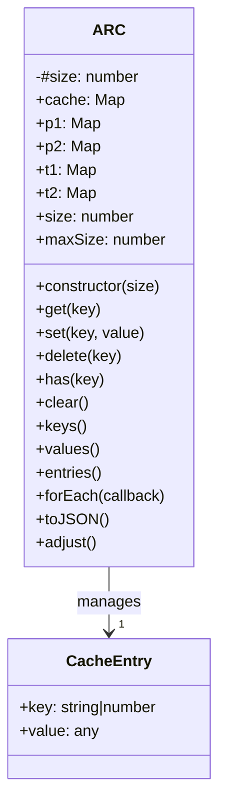
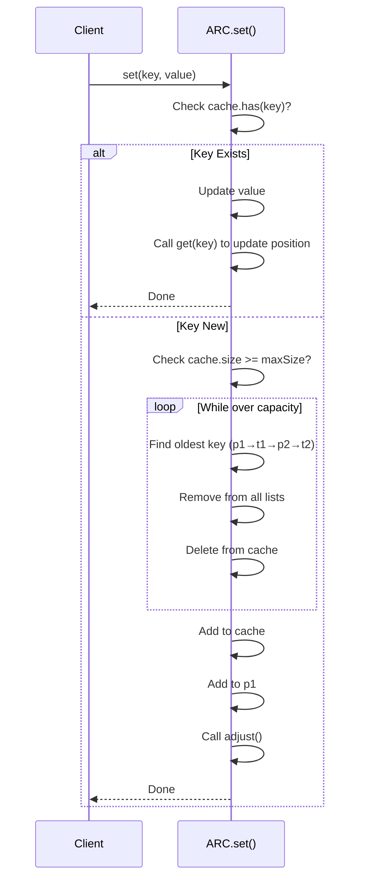
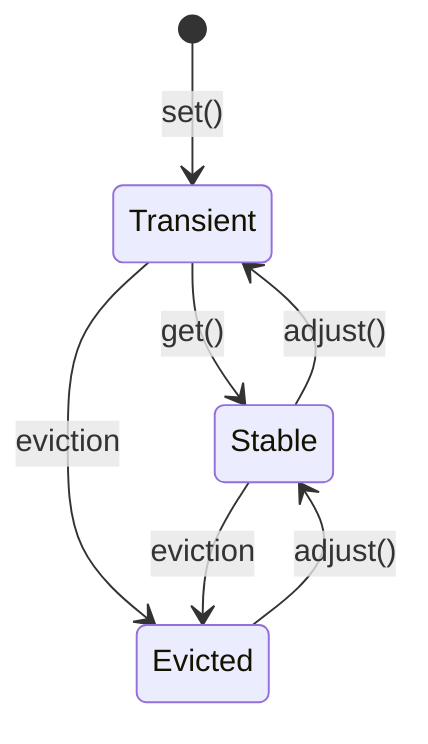

# ARC Architecture and Data Flow

## Overview

The `tiny-arc` library implements the Adaptive Replacement Cache (ARC) algorithm, which adaptively balances between recently accessed and frequently accessed items to maximize cache hit rates.

## Architecture

### Core Components



### Internal Data Structures

The ARC implementation maintains 5 maps:

| Map | Purpose | Contents |
|-----|---------|----------|
| `cache` | Main storage | All cached key-value pairs |
| `p1` | Recently accessed (transient) | Keys accessed once, recently |
| `p2` | Frequently accessed (stable) | Keys accessed multiple times |
| `t1` | Recently evicted (transient) | Keys evicted from p1 |
| `t2` | Frequently evicted (stable) | Keys evicted from p2 |

## Data Flow

### Retrieval Flow (get)

```mermaid
sequenceDiagram
    participant Client
    participant Cache as ARC.get()

    Client->>Cache: get(key)
    Cache->>Cache: Check cache.has(key)?
    alt Not Found
        Cache-->>Client: undefined
    else Found
        Cache->>Cache: Check which list contains key
        alt In p1
            Cache->>Cache: Move key to p2
            Cache->>Cache: Call adjust()
        alt In p2
            Cache->>Cache: Keep in p2
        alt In t1
            Cache->>Cache: Move to t2
            Cache->>Cache: Call adjust()
        alt In t2
            Cache->>Cache: Keep in t2
        end
        Cache-->>Client: Return value
    end
```

### Insertion Flow (set)



## The adjust() Method

The `adjust()` method maintains balance between the four tracking lists based on access patterns.

### Algorithm

1. Calculate `delta = max(p1.size - p2.size, 0) / 2`
2. Calculate `targetP1Size = floor((maxSize - delta) / 2)`
3. Move excess from p1 to t1 until p1 ≤ targetP1Size
4. Calculate `targetP2Size = maxSize - targetP1Size`
5. Move excess from p2 to t2 until p2 ≤ targetP2Size

### Visual Representation

```mermaid
flowchart TD
    A[adjust() called] --> B[Calculate delta]
    B --> C[Calculate targetP1Size]
    C --> D[Move from p1 to t1]
    D --> E[Calculate targetP2Size]
    E --> F[Move from p2 to t2]
    F --> G[Balance achieved]

    subgraph Lists [Cache Structure]
        P1[p1: transient recently accessed]
        P2[p2: stable frequently accessed]
        T1[t1: recently evicted]
        T2[t2: frequently evicted]
        C[cache: all entries]
        
        P1 --> C
        P2 --> C
        T1 --> C
        T2 --> C
    end
```

## Eviction Strategy

When the cache is at capacity and a new item is inserted:

1. **Loop while `cache.size >= maxSize`**:
   - Try to evict from `p1` first (FIFO)
   - Then from `t1`
   - Then from `p2`
   - Then from `t2`
2. **Remove from all four lists** (ensures complete cleanup)
3. **Remove from main cache**

This ensures that:
- Transient items are evicted first
- Stable items are preserved longer
- No stale references remain in any list

## State Transitions



### State Transition Table

| Current State | Action | New State |
|---------------|--------|-----------|
| Not in cache | set() | p1 (transient) |
| p1 (transient) | get() | p2 (stable) |
| p2 (stable) | get() | p2 (stable, moves to end) |
| t1 (evicted) | get() | t2 (evicted, stable) |
| t2 (evicted) | get() | t2 (evicted, stable, moves to end) |
| Any | adjust() | Balance lists based on access patterns |
| Any | eviction | Removed from all lists and cache |

## Memory Management

### Cleanup on Delete

When `delete(key)` is called:

```javascript
this.cache.delete(key);
this.p1.delete(key);
this.p2.delete(key);
this.t1.delete(key);
this.t2.delete(key);
```

All references are removed to prevent memory leaks and stale data.

### Clear Operation

When `clear()` is called, all maps are cleared simultaneously:

```javascript
this.cache.clear();
this.p1.clear();
this.p2.clear();
this.t1.clear();
this.t2.clear();
```

## Performance Characteristics

| Operation | Time Complexity | Notes |
|-----------|-----------------|-------|
| get() | O(1) | Map lookups are constant time |
| set() | O(n) | May evict n items before insertion |
| delete() | O(1) | Direct Map deletions |
| has() | O(1) | Map lookup |
| clear() | O(1) | Map.clear() |
| adjust() | O(n) | May move n items between lists |

## Factory Function

The `arc()` factory provides a convenient way to create cache instances:

```javascript
export function arc(options = {}) {
  return new ARC(options.size || 100);
}
```

| Option | Type | Default | Description |
|--------|------|---------|-------------|
| size | number | 100 | Maximum cache size |

## Design Decisions

### Why 5 Maps?

- **cache**: Single source of truth for cached values
- **p1/p2**: Distinguish between recently and frequently accessed
- **t1/t2**: Track evicted items for adaptive behavior

The p1/p2 and t1/t2 split allows ARC to adaptively determine whether to favor recency or frequency based on observed access patterns.

### Why Evict All Lists?

When evicting, all four lists are checked because:
1. The `adjust()` method may move items between lists
2. A key might be in any list depending on access pattern
3. Complete cleanup prevents memory leaks and stale references

### Why Use Transient and Stable Lists?

This design allows the cache to:
- Quickly identify recently accessed items (p1, t1)
- Identify frequently accessed items (p2, t2)
- Make intelligent eviction decisions based on patterns
- Maintain a hybrid of LRU (recency) and LFU (frequency) behavior
